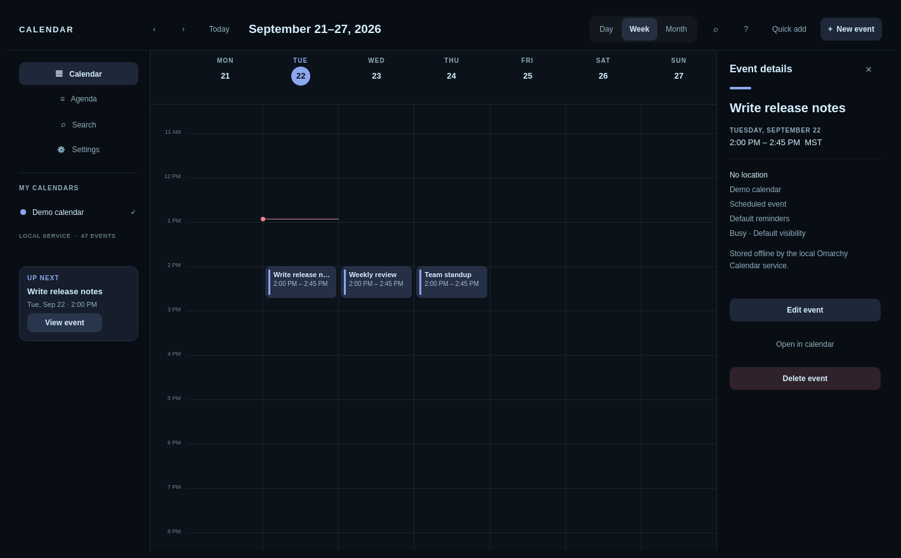
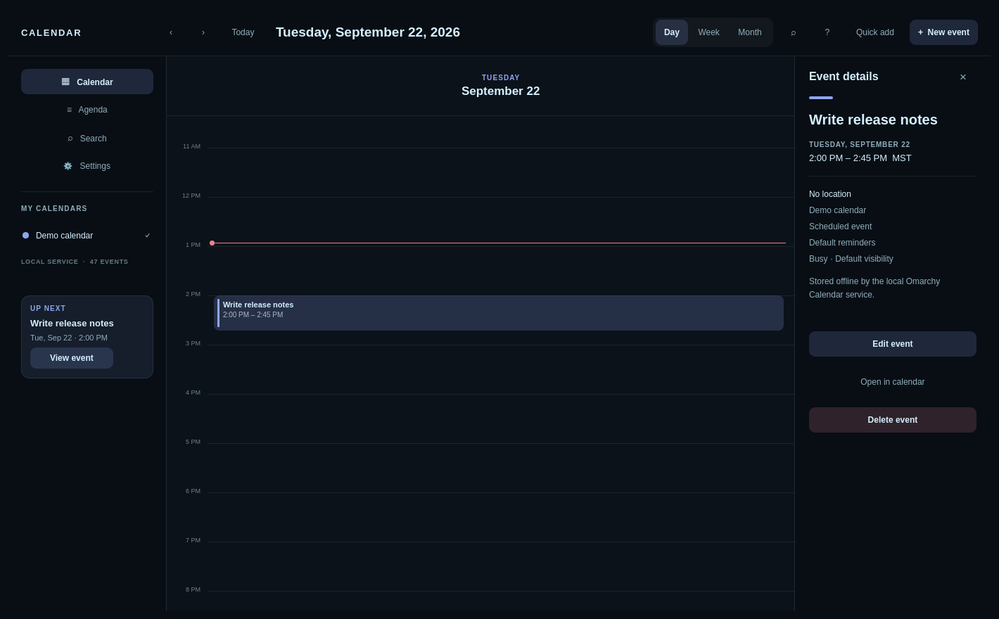
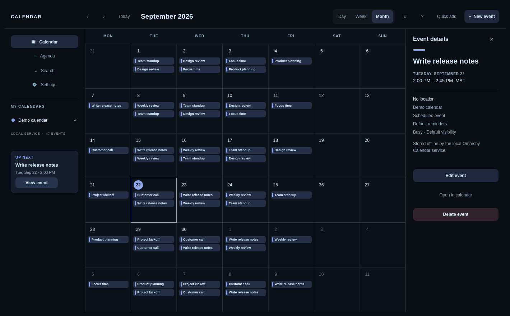
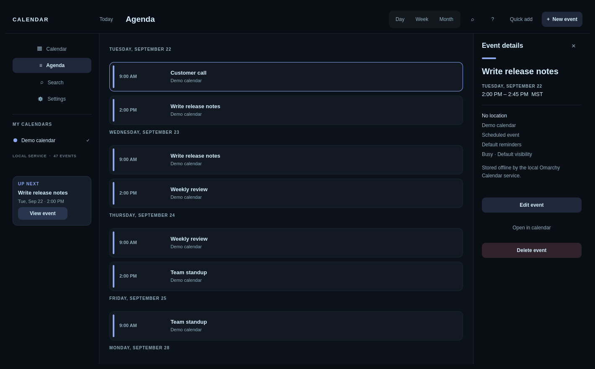
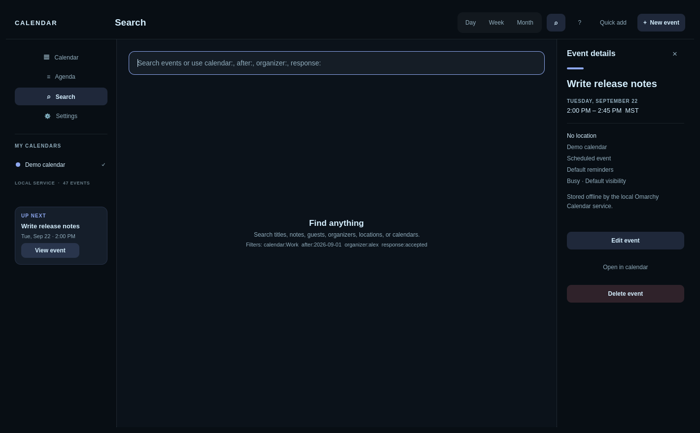
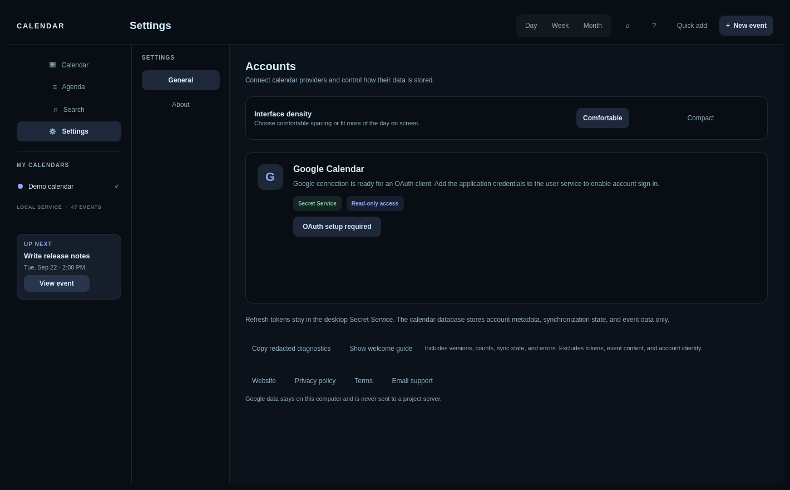
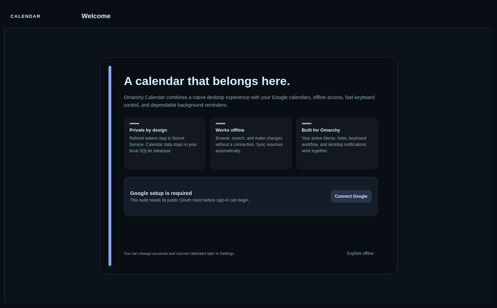

<div align="center">


# Omarchy Calendar

**A fast, native calendar for [Omarchy](https://omarchy.org/) that works offline and syncs with Google Calendar.**

[](https://github.com/jasona/omarchy-calendar/actions/workflows/ci.yml)
[](CHANGELOG.md)
[](LICENSE)
[](https://www.qt.io/)
[](https://archlinux.org/)

[Features](#-features) •
[Screenshots](#-screenshots) •
[Install](#-install) •
[Shortcuts](#%EF%B8%8F-keyboard-shortcuts) •
[Build from source](#%EF%B8%8F-build-from-source) •
[Contributing](#-contributing)

<br>



</div>

## 👋 Why this exists

Omarchy gives you a beautiful, keyboard-driven desktop, but checking your calendar still meant opening a browser tab. Omarchy Calendar is a real desktop app built with Qt 6 and QML. It picks up your Omarchy theme, works fine on a plane, and stays out of your way.

Your events live on your machine. Google Calendar is where they sync to, not the only place they exist.

## ✨ Features

- 🗓️ **See your time your way.** Switch between day, week, month, and agenda views. There's a live line showing the current time, and all-day events get their own space.
- ✈️ **Keep working offline.** Everything is stored in a local SQLite database. Edits you make offline get queued and synced to Google Calendar once you're back online.
- ✏️ **Edit right on the calendar.** Create, drag, resize, and delete events. You can also manage guests, reminders, repeating events, time zones, busy/free status, and meeting links.
- 🔍 **Find things fast.** Search titles, notes, locations, calendars, organizers, and guests. Narrow things down with filters like `calendar:`, `after:`, `before:`, `organizer:`, and `response:`.
- 🔔 **Stay in the loop.** You get desktop reminders and can reply to invitations. A sync inspector shows you anything that's still queued or has a conflict.
- 🎨 **Feels like Omarchy.** It follows your current palette and fonts, has two density modes, and works with the keyboard and screen readers.

## 📸 Screenshots

<table>
  <tr>
    <td align="center"><b>Day</b><br></td>
    <td align="center"><b>Week</b><br></td>
  </tr>
  <tr>
    <td align="center"><b>Month</b><br></td>
    <td align="center"><b>Agenda</b><br></td>
  </tr>
  <tr>
    <td align="center"><b>Search</b><br></td>
    <td align="center"><b>Settings</b><br></td>
  </tr>
  <tr>
    <td align="center" colspan="2"><b>Welcome</b><br></td>
  </tr>
</table>

## 📦 Install

> [!NOTE]
> Version **0.9.0** is the release candidate for v1.0. The first public release is waiting on Google's OAuth verification. Until it ships, [build from source](#%EF%B8%8F-build-from-source) instead.

Once a release is out, grab `omarchy-calendar-VERSION-aur.tar.gz` from the [Releases page](https://github.com/jasona/omarchy-calendar/releases), extract it, and run:

```bash
cd aur
makepkg -si
systemctl --user enable --now omarchy-calendar.service
```

That's it. Open **Omarchy Calendar** from your app launcher.

The package installs the app, a small background service that handles syncing, the icon, the desktop entry, and DBus activation files. Your database and settings live in your home directory, so they stick around when you upgrade.

### What you'll need for Google sign-in

Google sign-in stores your login in the system keyring, so you need a running, unlocked Secret Service provider. On Omarchy, `gnome-keyring` is usually already there. KWallet or KeePassXC (with Secret Service turned on) work too.

Heads up: `libsecret` is only the library that talks to the keyring. It isn't a keyring itself. If you're not signed in, you can still see all your cached events offline.

> [!TIP]
> Official releases come with the publisher's Google OAuth client already set up. If you're building for development, follow the [Google OAuth setup guide](docs/google-oauth-setup.md) and put your own client config in `~/.config/omarchy-calendar/google-oauth.env`.

## ⌨️ Keyboard shortcuts

| What you want to do | Keys |
| --- | --- |
| Day / Week / Month / Agenda | <kbd>1</kbd> / <kbd>2</kbd> / <kbd>3</kbd> / <kbd>4</kbd> |
| Jump to today | <kbd>T</kbd> |
| Search | <kbd>/</kbd> |
| New event / Quick Add | <kbd>N</kbd> / <kbd>Ctrl</kbd>+<kbd>K</kbd> |
| Edit / delete the selected event | <kbd>E</kbd> / <kbd>Delete</kbd> |
| Settings / every shortcut | <kbd>Ctrl</kbd>+<kbd>,</kbd> / <kbd>F1</kbd> |

Move between events with the arrow keys or <kbd>J</kbd> / <kbd>K</kbd>. In day and week views, you can nudge the selected event:

- <kbd>Alt</kbd>+<kbd>↑</kbd> / <kbd>↓</kbd> moves it 15 minutes
- <kbd>Alt</kbd>+<kbd>←</kbd> / <kbd>→</kbd> moves it a day
- <kbd>Alt</kbd>+<kbd>Shift</kbd>+<kbd>↑</kbd> / <kbd>↓</kbd> makes it shorter or longer

**Quick Add** understands everyday phrasing. Type something like "Team sync tomorrow 10am for 45m" or "Lunch next Friday noon", check what it came up with, and save.

## 🧩 How it works

```text
┌────────────────────┐                ┌────────────────────────────┐
│  Omarchy Calendar  │                │  omarchy-calendar-service  │                 ┌───────────────────┐
│  (Qt 6 / QML app)  │  ◀── DBus ──▶  │  (systemd user service)    │  ◀── HTTPS ──▶  │  Google Calendar  │
└────────────────────┘                └──────────────┬─────────────┘                 └───────────────────┘
                                                     │
                                                     ▼
                               ~/.local/share/omarchy-calendar/calendar.db
```

- The **app** is the part you see. It gets your calendar data from the service over DBus. If the service isn't running, it falls back to the Omarchy JSON calendar feed.
- The **service** runs in the background, keeps everything in SQLite, and handles syncing with Google.
- The **theme** comes from `~/.local/state/omarchy/current/theme/colors.toml`, and font overrides come from `~/.config/omarchy/shell.toml`.

Want to talk to the service yourself? Check out the [DBus API docs](docs/dbus-api.md).

## 🛠️ Build from source

### Requirements

- Qt **6.5+** (Core, DBus, Gui, Network, NetworkAuth, Qml, Quick, QuickControls2, Sql)
- A C++20 compiler
- CMake **3.21+** and Ninja (or qmake6 if you want the quick route)
- `libsecret` and `pkg-config`

### With CMake (same as the package build)

```bash
cmake -S . -B build -G Ninja -DCMAKE_BUILD_TYPE=Release
cmake --build build
```

<details>
<summary><b>Quick build with qmake</b></summary>

<br>

Build the desktop app:

```bash
mkdir -p build-qmake
cd build-qmake
qmake6 ../omarchy-calendar.pro
make -j"$(nproc)"
./omarchy-calendar
cd ..
```

Build the background service from the repo root:

```bash
mkdir -p build-service
cd build-service
qmake6 ../service/omarchy-calendar-service.pro
make -j"$(nproc)"
cd ..
```

</details>

## 🧪 Testing

Build the service first, then run the contract tests from the repo root:

```bash
./tests/run-contract-tests.sh build-service/omarchy-calendar-service
```

For visual checks, `./tests/capture-visual-baseline.sh` takes light and dark mode screenshots. The app also accepts `--view <name>` and `--screenshot <path>`, which is handy for automated captures. Run `omarchy-calendar --release-info` to see the public metadata baked into a build.

## 🚀 Releases

- 📋 [Release checklist](docs/google-oauth-release-checklist.md): what has to happen before a public release, including Google OAuth verification
- 🏗️ [Arch release guide](docs/arch-release.md): local prep, clean-chroot validation, and AUR submission
- 📝 [Changelog](CHANGELOG.md): what's changed in each version

## 🤝 Contributing

Issues and pull requests are welcome! If you've found a bug, have an idea, or want to fix something that's bugging you, go ahead and open an issue or send a PR.

Before you open a PR, please make sure the contract tests pass. If your change affects the UI, a screenshot or two really helps.

## 🔒 Security

If you find a security issue, please **don't** open a public issue. Report it privately by following the steps in [SECURITY.md](SECURITY.md).

## 📄 License

Omarchy Calendar is released under the [MIT License](LICENSE).

<div align="center">
<br>
Made with ☕ for the Omarchy community.
</div>
